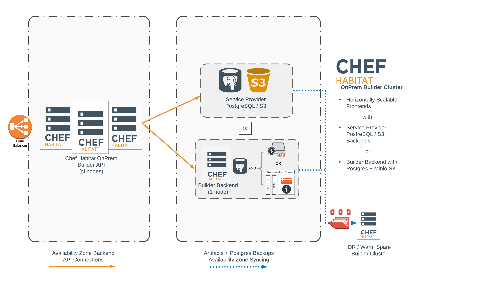

# High Availability

Currently, the only supported HA solution is via consumption of SaaS backend services (AWS RDS, AWS S3).
There is no other fully OnPrem supported solution for providing Highly Available Builder services.
We have prioritized this work and a supported solution will eventually be available.

# Disaster Recovery / Warm Spare

In the event that you need to quickly recover from an outage or that you have some planned upgrades
or maintenance work, you can leverage a Warm Spare / Disaster Recovery installation methodology.

The following architecture diagram depicts the data synchronization process that can be used to
increase the availability of the Builder API and backend for Disaster Recovery and Warm Spare
scenarios.

## Synchronization Components

To enable the DR / Warm Spare deployment methodology, you will need to provision an equal number of
frontend/backend systems as there are in your primary location. These will serve as your DR / Warm
Spare environment and, if to be used for DR, should exist in a separate Availability Zone with
separate storage.

The data that Builder stores is luckily fairly lightweight and thus the backup and DR or Warm Spare
strategy is pretty straightforward. On-Prem Builder has two types of data that should be backed up
case of a disaster or workload transfer to the Warm Spare:

1. PostgreSQL package and user metadata
1. Habitat Artifacts (.harts)

All data should be backed by highly available storage subsystems and either replicated or backed up
as indicated in the following sections.

Ideally, you should coordinate the backup of the entire Builder on-prem cluster to happen together.
However, the type of data that Builder stores (metadata and artifacts) permits some flexibility in
the timing of your backup operations. In the worst case, if a package's metadata is missing from
PostgreSQL, you can repopulate it by re-uploading the package with the --force flag, for example:
`hab pkg upload <path to hartfile> -u <on-prem_url> --force`.

### PostgreSQL

If using AWS RDS, you should be taking periodic snapshots of the RDS instance. For Disaster Recovery,
you can choose to use a Multi-AZ RDS Deployment.

For non-RDS deployments, backing up the Postgres data is detailed [here](./postgres.md#postgresql-data-backups)

The backups should be periodically restored into the DR / Warm Spare via a scheduled automated process
such as a crontab script. The restore can be run remotely from the same host that was used to create
the backup. The Builder database is relatively small, likely only tens of megabytes.

### Habitat Artifacts

Habitat Artifacts can exist in one of two locations:

1. Minio
1. S3 bucket

In the event that your backend is using Minio for Artifact storage/retrieval, it should be backed by
highly available storage. Backing up Minio data is detailed [here](./minio.md#managing-builder-on-prem-artifacts).
If choosing a Warm Spare deployment in the same availability zone/datacenter and the filesystem is
a network attached filesystem, it can also be attached to the Warm Spare. However, make sure that
only one Builder cluster is ever accepting live traffic when sharing the same filesystem. For Disaster
Recovery, the filesystem should be replicated to the alternate availability zone/datacenter.

If Artifacts are stored directly in an S3 bucket, the same bucket can be used for a Warm Spare in the
same availability zone/datacenter. In the case of Disaster Recovery, the S3 bucket should be replicated
to the alternate availability zone/datacenter. In the case of AWS S3, this replication is already
built into the service.

In the case that you are not re-attaching the Minio filesytem to the Warm Spare, the backups should
be periodically restored into the DR / Warm Spare via a scheduled automated process such as a crontab
script.
